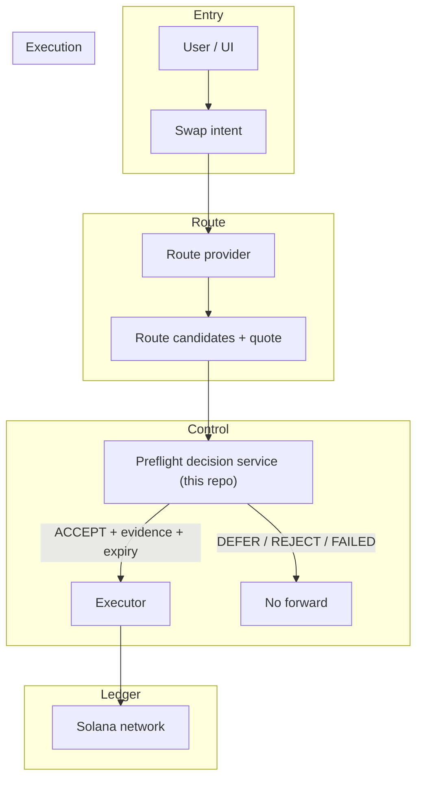

# Blockchain Transaction Calculator

## Purpose

This repository evolves a local transaction calculator into a Solana swap decision system.

The system decides whether a swap request should be `accept`, `defer`, `reject`, or `fail_closed`. It is a pre-trade decision layer, not a swap executor.

## Problem

We are building a Solana swap preflight decision engine.

It is not a wallet, not a swap executor, not a trading bot, and not an on-chain program.

The system answers one question:

```text
Given a proposed Solana swap, should this request be forwarded, deferred, rejected, or failed closed?
```

A caller sends a proposed swap intent:

```text
USDC -> SOL
amount
route candidates
quote age / slot
source hashes
dedupe key
request id
```

The system must:

1. Normalize the request.
2. Check dedupe and replay.
3. Validate freshness.
4. Validate source integrity.
5. Score route candidates.
6. Estimate fees.
7. Estimate slippage.
8. Compute breakeven.
9. Compute `EV_estimate`.
10. Compute `EV_lower_bound`.
11. Apply risk gates.
12. Produce a terminal decision.
13. Persist the decision.
14. Emit an audit event.
15. Return the decision to the caller.

The output is:

```text
ACCEPT | DEFER | REJECT | FAILED
```

`ACCEPT` means the proposed swap clears the preflight economic and operational gates. It does not mean the swap was executed.

Solana is involved as decision context: slot freshness, quote age, route candidates, liquidity/source hashes, fee estimation, slippage estimation, route risk, and source conflict detection. v2 may use devnet or simulation as an input-validation layer, but the system still does not run the swap.

The system exists to prevent bad forwarding decisions: stale swaps, duplicate swaps, negative-EV swaps, high-risk routes, conflicting source data, wasted downstream execution capacity, and decisions that cannot be replayed or audited.

One-line definition:

```text
This is a bounded, replay-safe, auditable Solana swap preflight decision service.
```

## Position In The Swap Stack

This service sits between a route provider and an executor.

- Route provider: proposes route candidates and quotes for an intent.
- This service: decides whether forwarding is allowed, and returns a decision with evidence and expiry.
- Executor: signs and submits transactions if and only if the decision permits it.



Core ownership:

- Scala owns request lifecycle, state, policy, replay, persistence, and audit.
- Rust owns heavy Solana compute for quote, route, slippage, fee, breakeven, EV, freshness, and risk.
- gRPC owns the typed boundary between Scala orchestration and Rust compute.

## Architecture Principles

- Every request must have a typed identity and dedupe key.
- Every request must reach exactly one terminal outcome.
- Duplicate requests must replay from durable truth, not recompute.
- Accept requires positive `EV_lower_bound`.
- Stale, conflicting, oversized, or malformed inputs must not produce accept decisions.
- Rust offload is valid only when saved compute exceeds boundary, validation, retry, and failure cost.
- Terminal decisions must be persisted before replay can rely on them.
- Audit coverage must exist for every terminal request.

## v0: Local Scala Prototype

Status: local computation proof.

v0 made weak production claims because it only proved local arithmetic. It did not model a Solana swap preflight request, did not carry durable identity, did not persist terminal outcomes, did not suppress duplicates, did not audit, and did not define a transport boundary. Its concurrency path used Futures around local state, not a bounded request lifecycle.

Scope:

- In-process Scala ledger demo.
- Immutable `Map[String, Double]` balance updates.
- Basic add/subtract validation.
- Local unit tests for balance behavior.
- Futures-based concurrency sketch.

Non-goals:

- no request envelope
- no durable identity
- no dedupe contract
- no replay safety
- no bounded queues
- no actor partitioning
- no persistence
- no audit trail
- no production throughput claim

Conclusion: `v0` proves local arithmetic only. It is not the operational architecture.

## v1: Bounded Risk System

Status: bounded Solana swap-preflight decision service.

Target posture: correctness under controlled load.

Notes:

- v1 does not expose a remote REST/HTTP boundary yet. Ingress is internal (Akka actor messages / benchmarks).
- gRPC in v1 is the Scala->Rust compute boundary.

Request shape:

- `request_id`
- `dedupe_key`
- token pair
- amount
- route candidates
- slot and quote freshness
- source hashes
- model version

Lifecycle:

```text
ingress -> normalize -> dedupe -> classify -> queue -> gRPC compute
-> persist decision -> publish audit -> complete/replay
```

Scala orchestrator responsibilities:

- typed lifecycle control
- Akka actor orchestration
- dedupe lookup
- retry and failure policy
- gRPC dispatch
- decision persistence
- audit publishing
- reconciliation

Rust compute responsibilities:

- quote evaluation
- route scoring
- slippage cost
- fee cost
- breakeven margin
- `EV_estimate`
- `EV_lower_bound`
- freshness checks
- source checks
- risk scoring

Production-shaped dependencies:

- PostgreSQL: durable terminal decision source
- Valkey: hot-path dedupe/cache
- Redpanda: append-only audit stream
- Docker Compose: local full-stack deployment

gRPC decision:

- required for a typed Scala/Rust boundary
- required for measurable serialization and transport cost
- required for deadlines and transport failure handling
- required for independent scaling of Rust compute
- required for containerized service boundaries

FFI was dropped as the runtime boundary because it couples Scala process health to Rust memory/runtime behavior, makes isolation and independent scaling harder, complicates deploy and rollback, and hides boundary cost inside a single process. gRPC makes the cross-runtime contract explicit, observable, timeout-bound, and service-deployable.

Rust compute is offloaded because quote, route, slippage, fee, breakeven, EV, freshness, and risk calculations are the hot numeric path. Scala remains the control plane because request lifecycle, policy, replay, persistence, audit, and recovery need coherent state ownership.

v1 target: `1,000,000 ops/hour` as a budget, equal to about `277.78 ops/sec`.

v1 does not claim mainnet economic proof. It proves bounded decision behavior, durable replay, auditability, and positive lower-bound EV gating under controlled benchmark conditions.

## v2: Distributed Operating Edge

Status: first go-live target.

Target posture: operate the preflight decision service while keeping swap execution out of scope.

Design:

- Microservice split in a VPC:
  - control plane: Scala REST ingress + policy + lifecycle + persistence + outbox + reconciliation
  - compute plane: Rust gRPC compute
  - data plane: Postgres (decisions + outbox), Valkey (dedupe cache)
  - audit plane: Redpanda (outbox shipping sink)
- Only REST ingress is exposed; everything else is internal.
- `ACCEPT` requires a committed Postgres decision + outbox write.

Required controls:

- bounded actor mailboxes
- bounded queues
- hot-key isolation
- worker-pool sizing
- per-stage latency budgets
- retry amplification limits
- freshness-window enforcement
- model-version compatibility checks
- replay across restart and redeploy
- cost per decision
- cost per accepted decision
- explicit resource ceilings for CPU, memory, disk, queues, workers, gRPC calls, database pools, cache connections, and audit backlog

Health model:

- SLIs: latency, error rate, queue depth, audit lag, replay drift, dedupe hit rate, freshness failure rate, compute saturation
- SLOs: decision latency, terminal coverage, duplicate suppression, audit coverage, replay correctness
- SLAs: only after SLOs are proven under representative load

Observability:

- OpenTelemetry across Scala, gRPC, Rust, PostgreSQL, Valkey, and Redpanda
- Jaeger for distributed request tracing
- per-stage latency attribution
- cross-service failure attribution

v2 success requires accepted requests to clear lower-bound EV, operating cost, freshness, risk, source integrity, replay, and observability controls at target throughput.

## v3: Solana Mainnet Target

Status: business-mature Solana expansion target.

Target posture: close the gap between preflight decisions and real Solana business outcomes.

Mainnet risks:

- adversarial liquidity
- slot drift
- priority-fee volatility
- account contention
- validator behavior variance
- RPC instability
- transaction expiry
- fast-changing pool state
- quote-to-execution drift

Required Solana controls:

- slot-aware freshness
- blockhash lifetime enforcement
- transaction validity windows
- priority fee strategy
- compute-unit pricing strategy
- RPC quorum and fallback
- source integrity checks
- writable account hot-spot detection
- pool-state drift detection
- route validity checks
- preflight and simulation policy
- post-submit reconciliation
- landed, failed, dropped, and expired transaction classification
- wallet, signer, and key-management boundaries
- incident response and circuit breakers

Required realized-outcome tracking:

- `EV_estimate`
- `EV_lower_bound`
- submitted transaction metadata
- landed or failed transaction status
- final slot
- confirmation depth
- realized output amount
- realized fees
- realized priority fees
- realized slippage
- `EV_realized`

v3 must close the loop between decision EV and settled Solana outcome. The system must stop accepting when RPC confidence drops, source hashes conflict, slot lag grows, route validity decays, audit coverage breaks, fees exceed limits, or realized EV diverges from the model.

With the current boundary, v3 is where mainnet execution maturity belongs if the system expands beyond preflight decisions. v3 must decide whether to integrate transaction construction, signing, submission, confirmation, settlement, and realized-EV reconciliation. Until then, v1 and v2 remain non-custodial preflight decision systems.

## Version Summary

- `v0`: local Scala arithmetic proof.
- `v1`: bounded Scala/Rust/gRPC decision system with durable replay and audit.
- `v2`: production-grade Akka Cluster orchestration with independently scalable Rust compute, Terraform/GCP deployment, runbook, bounded resources, OTEL, Jaeger, SLI/SLO/SLA posture, and `1M ops/hour` operating target.
- `v3`: business-mature Solana expansion with possible mainnet execution, settlement, fee, routing, freshness, and realized-EV controls.
