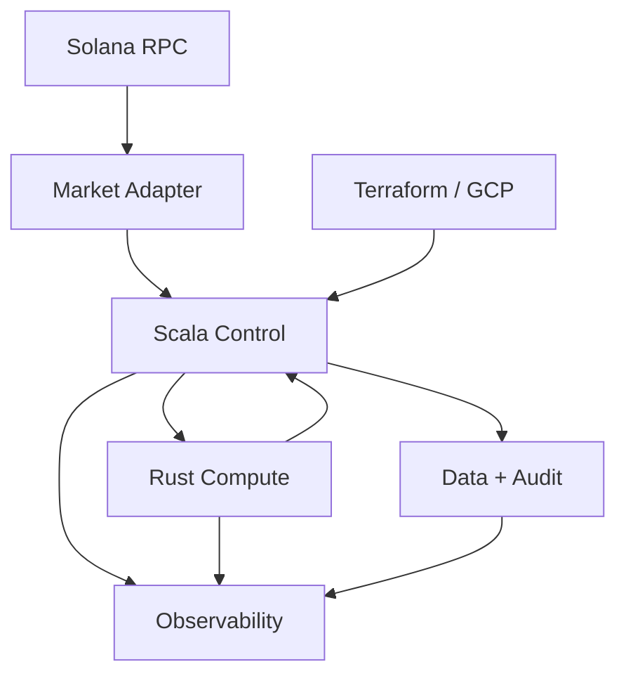

# v2 Look Ahead

## Goal

v2 is a live, non-executing Solana swap preflight decision service.

It answers:

```text
Given a proposed Solana swap, should it be ACCEPTED, DEFERRED, REJECTED, or FAILED_CLOSED?
```

It must use real Solana/market context, but it must not move funds.

## Boundaries

In scope:

- Solana RPC read context.
- Market adapter for quote, route, fee, liquidity, token metadata, and source snapshot.
- Scala Akka control plane.
- Rust compute plane over gRPC.
- Durable decisions, dedupe, replay, audit, observability, Terraform/GCP, runbooks.

Out of scope:

- wallet
- signer
- private keys
- transaction construction
- transaction submission
- settlement
- custody
- high availability
- customer-facing SLA

v3 is where execution and monetized business maturity can be considered.

## Architecture



## Critical Rule

`ACCEPT` is allowed only when:

```text
EV_lower_bound > operating_cost
              + fee_uncertainty
              + slippage_uncertainty
              + source_uncertainty
              + safety_margin

source_snapshot = complete
freshness_valid = true
rpc_health = healthy
token_supported = true
route_supported = true
program_allowed = true
liquidity_confidence >= minimum
risk_score <= limit
exposure <= limit
model_version = active
decision_not_expired = true
persistence = healthy
audit = healthy
```

If any field is unknown, missing, stale, or untrusted, the result is `DEFER`, `REJECT`, or `FAIL_CLOSED`.

## Technical Minimum

- Akka owns request lifecycle, dedupe, replay, policy, persistence, audit, and reconciliation.
- Rust owns quote, route, fee, slippage, breakeven, EV, freshness, and risk computation.
- gRPC is the Scala/Rust boundary with deadlines.
- Postgres stores durable terminal decisions.
- Valkey handles hot-path dedupe.
- Redpanda receives audit events.
- Every terminal decision has an audit outbox row.
- Every duplicate logical request replays durable truth.
- Every queue, mailbox, worker pool, DB pool, gRPC call, retry, and request lifetime has a bound.
- Overload must become `DEFER`, `REJECT`, or `FAIL_CLOSED`, not hidden backlog.

## Market Adapter Minimum

The market adapter must create the source snapshot. The caller must not be trusted to provide truth.

Required snapshot fields:

- token mints
- token decimals
- amount in base units
- supported-token status
- quote output
- route candidates
- AMM/program identity
- pool/account context where available
- fee context
- liquidity signal
- Solana slot
- quote age
- RPC/provider identity
- source timestamp
- source confidence
- canonical snapshot hash

If the snapshot cannot be built or hashed, `ACCEPT` is illegal.

## Solana Reality Minimum

- Define RPC endpoint policy.
- Define commitment level.
- Define max slot lag.
- Define max quote age.
- Define supported token list.
- Define supported program/route list.
- Reject unknown tokens.
- Reject unknown programs.
- Use integer base units for money amounts.
- Do not use floating point in final money-decision storage.
- Expire every `ACCEPT` by slot age and wall-clock age.

Devnet/simulation may validate integration. It is not mainnet economic proof.

## No-Execution Proof

v2 must be structurally unable to move funds:

- no signer dependency
- no private keys
- no transaction submission code path
- no `sendTransaction` equivalent
- startup fails if signer or submit config exists
- tests prove no execution path exists

## Stop-Accept Conditions

Stop emitting new `ACCEPT` decisions when:

- Postgres cannot persist decisions.
- Audit outbox cannot be written.
- Market adapter cannot build complete snapshots.
- RPC is stale, lagged, or unhealthy.
- Dedupe drift appears.
- Queue age exceeds limit.
- Rust compute saturates.
- gRPC deadline failures spike.
- Source conflict or stale quote rate spikes.
- Exposure limit is reached.
- Unknown model, token, program, schema, or release appears.
- Rollback path is unavailable during deploy.

## Evidence Per Decision

Every terminal decision must be reconstructible from:

- Postgres decision row
- audit event
- source snapshot
- trace/logs/metrics

Required fields:

- `trace_id`
- `request_id`
- `dedupe_key`
- `decision_id`
- `terminal_state`
- `reason_code`
- `schema_version`
- `model_version`
- `source_snapshot_hash`
- `slot`
- `quote_age`
- `token_in`
- `token_out`
- `amount_base_units`
- `selected_route`
- `EV_estimate`
- `EV_lower_bound`
- `risk_score`
- `exposure_used`
- `exposure_limit`
- `decision_expires_at`

## Go-Live Proof

Do not call v2 live until all are true:

1. Terraform can recreate the GCP instance.
2. Compose starts the full stack from documented config.
3. Secrets are not in source control.
4. Health/readiness checks exist.
5. Backup and restore are tested.
6. Rollback is tested.
7. Audit replay and reconciliation are tested.
8. Failure injection covers Postgres, Valkey, Redpanda, Rust compute, gRPC timeout, market adapter failure, RPC stale response, partial write, and process restart.
9. Load test proves `1,000,000 ops/hour` under mixed traffic, hot keys, duplicate storms, stale quotes, oversized routes, dependency latency, and Rust saturation.
10. Dashboards and alerts exist for latency, queue age, replay drift, audit lag, dependency errors, compute saturation, exposure, and economic decision distribution.
11. Runbooks exist for deploy/rollback, stop-accept/resume, dependency degradation, source/RPC failure, exposure breach, bad model/config, disk pressure, and restore.

## Definition Of Done

v2 is ready only when it proves:

- real source snapshots
- bounded request processing
- replay-safe dedupe
- durable terminal decisions
- no execution path
- positive lower-bound economics for every `ACCEPT`
- supported token/route/program discipline
- expiring decisions
- fail-closed unsafe states
- reconstructible audit trail
- tested rollback, restore, failure injection, and load envelope
