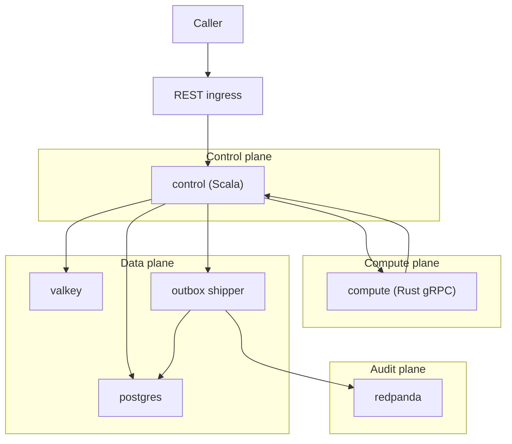

# v2 Look Ahead

v2 is a Solana swap preflight decision service.

It answers one question:

```text
Given a proposed Solana swap, should it be ACCEPT, DEFER, REJECT, or FAILED_CLOSED?
```

It must use Solana/market context, and it must be unable to move funds.

## Plane Model

v2 is a microservice deployment in a GCP VPC.

- Entry plane: REST ingress (Scala control plane).
- Control plane: Scala (Akka) owns lifecycle, policy, dedupe/replay, persistence, outbox, reconciliation, stop-accept.
- Compute plane: Rust owns numeric compute behind internal gRPC.
- Data plane: Postgres is the durability boundary; Valkey is a cache acceleration only.
- Audit plane: Redpanda is downstream distribution; outbox in Postgres is evidence.

## Architecture Boundaries

Planes map to microservices.

Control plane:

- `control` (Scala): REST ingress + lifecycle + policy + persistence + outbox + reconciliation.

Compute plane:

- `compute` (Rust): gRPC compute.

Data plane:

- `postgres`: decisions + outbox tables.
- `valkey`: dedupe cache.

Audit plane:

- `redpanda`: audit stream sink fed by outbox shipper.

Only REST ingress is exposed. Everything else is internal.



## Entry Boundary

- v2 MUST expose a REST ingress.
- Access MUST be gated by a GCP firewall IP allowlist to your PC (no broad public access).
- The service MUST enforce request authentication and rate/burst limits.
- Internal Scala->Rust MUST remain gRPC with deadlines and cancellation.

## Out Of Scope

v2 MUST NOT include:

- signer, private keys, custody
- transaction construction or submission
- any “forward-to-executor” mode

v3 is where execution and monetized business maturity can be considered.

## Invariants

Request identity and terminalization:

- Every request MUST carry `request_id` and `dedupe_key`.
- Exactly-once terminalization MUST be enforced by uniqueness (database).
- Every logical request MUST end in exactly one terminal outcome.
- Duplicate requests MUST return the recorded terminal decision.

Durability and audit evidence:

- The system MUST persist the terminal decision before acknowledging it.
- The system MUST write an audit outbox row in the same Postgres transaction as the terminal decision.
- `ACCEPT` MUST NOT be returned unless the decision+outbox transaction commits.
- Redpanda availability MUST NOT be a prerequisite for `ACCEPT`.
- Outbox shipping MUST handle poison rows:
  - One bad outbox row MUST NOT block shipping of later rows.
  - Outbox rows MUST have a terminal state (`sent` or `dead`) with an error reason.
  - Invalid outbox payload generation is a stop-accept condition.

Bounds:

- Ingress MUST enforce numeric limits (request bytes, routes, hops, inflight, queue depth, retries, request lifetime).
- Rust compute MUST enforce numeric limits (routes, hops, numeric ranges) and MUST run under a deadline.
- Overload MUST fail closed (`FAILED_CLOSED`).

No execution:

- v2 MUST be unable to execute swaps: no signer, no tx submission path, no keys, no execution libraries.
- Startup MUST fail if any execution configuration is present.
- Tests MUST prove there is no execution or execution-adjacent path.

Reconstructible `ACCEPT`:

- For every `ACCEPT`, the system MUST be able to retrieve:
  - canonical normalized input bytes
  - canonical source snapshot bytes (or a pointer to stored bytes)
  - deterministic `source_snapshot_hash` for those bytes
  - exact policy bundle version (limits + supported lists + gate thresholds)
  - exact model/config version
  - exact release/version identifier
  - gate evaluation trace to justify the decision
- If any required artifact is missing, ambiguous, or conflict-ridden, `ACCEPT` is illegal.

## Source-Of-Truth Policy

The caller MUST NOT be trusted to provide truth.

- The market adapter MUST build a canonical source snapshot from defined providers.
- Decision throughput MUST be decoupled from provider call rate:
  - snapshots are polled/cached asynchronously under bounds
  - per-request RPC/quote fetching is forbidden for go-live
- Provider conflict MUST be detected and MUST block `ACCEPT`.

Snapshot contents:

- token mints, decimals, and supported-token status
- amount in integer base units
- quote/route candidates and provider identity
- program/venue identity (allowed list applies)
- fee context, liquidity signal, confidence, timestamp
- Solana slot and quote age (slot + wall-clock)
- canonical snapshot bytes + snapshot schema version + snapshot hash

## `ACCEPT` Rule

`ACCEPT` is allowed only when every gate evaluates TRUE under the active policy bundle:

```text
EV_lower_bound > operating_cost
              + fee_uncertainty
              + slippage_uncertainty
              + source_uncertainty
              + safety_margin
```

And:

```text
source_snapshot_complete = true
source_snapshot_fresh = true
source_snapshot_conflict_free = true
token_supported = true
program_allowed = true
route_supported = true
liquidity_confidence >= minimum
risk_score <= limit
exposure <= limit
model_version = approved_and_active
decision_not_expired = true
persistence_writable = true
outbox_writable = true
compute_within_budget = true
```

Unknown, missing, or untrusted inputs MUST NOT produce `ACCEPT`.

## Stop-Accept Conditions

Stop emitting new `ACCEPT` decisions when any is true:

- Postgres is not writable (decision/outbox commit fails).
- Market adapter cannot build fresh, complete, conflict-free snapshots.
- Rust compute is unavailable or deadline failures breach threshold.
- Queue age exceeds bound or inflight exceeds bound.
- Dedupe drift is detected (terminal mismatch between cache and database truth).
- Exposure accounting cannot be evaluated or is at/over limit.
- Policy bundle or model/config version is unknown, unapproved, or inconsistent.

## Evidence (Required Fields)

Every terminal decision MUST carry (at least):

- `trace_id`
- `request_id`
- `dedupe_key`
- `decision_id`
- `terminal_state`
- `reason_code`
- `schema_version`
- `release_version`
- `policy_bundle_version`
- `model_version`
- `source_snapshot_schema_version`
- `source_snapshot_hash`
- `slot`
- `quote_age`
- `token_in`
- `token_out`
- `amount_base_units`
- `selected_route`
- `EV_estimate`
- `EV_lower_bound`
- `risk_score`
- `exposure_used`
- `exposure_limit`
- `decision_expires_at`

## Go-Live Proof

v2 is not go-live until each is proven end-to-end:

1. REST ingress is deployed behind a firewall IP allowlist and enforces auth + bounds + deadlines.
2. Canonical snapshots exist (bytes + schema + hash) and are referenced by decisions.
3. Exactly-once terminalization is DB-enforced and duplicate replay returns database truth.
4. `ACCEPT` implies a committed decision+outbox transaction in Postgres.
5. Outbox shipping to Redpanda is idempotent; lag is measured; stop-accept threshold exists.
5a. Outbox shipping handles poison rows (dead-letter exists; poison count is visible; poison does not block shipping).
6. No-execution proof holds (build/startup/test guards).
7. Load + failure tests demonstrate behavior at `1,000,000 ops/hour` decision throughput using cached snapshots (not per-request RPC).
