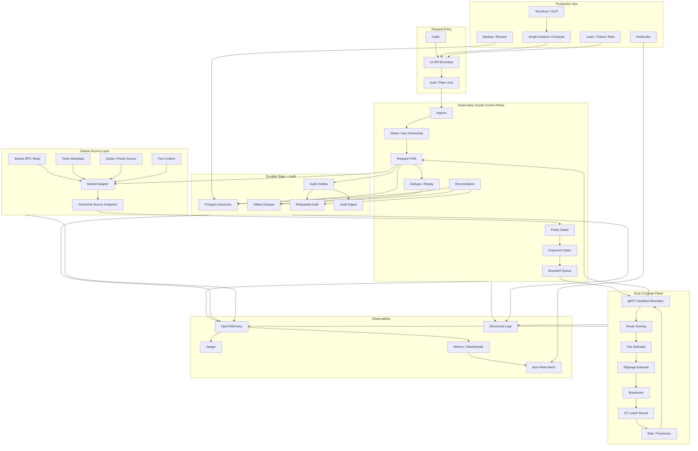

# v2 Delivery Plan

This plan expands the critical v2 contract in [`look-ahead.md`](./look-ahead.md) into an implementation gap register.

It must run live as a non-executing Solana swap preflight decision service. It must use real Solana/market context, prove bounded operation, and make every `ACCEPT` decision reconstructible.

## Design Evolution

v1 already establishes the core control loop:

- Scala orchestrates request lifecycle, dedupe, persistence, audit, and replay.
- Rust performs swap-preflight compute behind gRPC.
- PostgreSQL stores terminal decisions.
- Valkey handles hot-path dedupe.
- Redpanda receives audit events.

v2 evolves that loop into a live non-executing Solana decision system:

- Add a real Solana source layer before policy and compute.
- Add a market adapter that builds canonical source snapshots.
- Move from local actor orchestration toward Akka Cluster ownership and bounded partitioning.
- Add exposure gates before compute dispatch.
- Add decision expiry and no-execution proof.
- Add audit digesting so every terminal decision is reconstructible.
- Add production observability, Terraform/GCP deployment, runbooks, and failure/load proof.

## Technical Gaps

1. Akka Cluster is not implemented yet.
2. No shard/key ownership model.
3. No shard handoff behavior.
4. No per-key serialization model.
5. No hot-key isolation.
6. No bounded actor mailbox config.
7. No bounded dispatcher config.
8. No bounded ingress queue.
9. No bounded compute dispatch queue.
10. No explicit `Q_max`, `W_max`, `R_max`.
11. No production API boundary for incoming requests.
12. No request authentication boundary.
13. No market adapter.
14. No Solana RPC read client.
15. No source snapshot builder.
16. No token metadata adapter.
17. No route/provider adapter.
18. No fee context adapter.
19. No liquidity context adapter.
20. No decision expiry implementation.
21. No no-execution guard.
22. No code-level proof that signing/submission cannot happen.
23. No schema migration tool.
24. No versioned config loader for risk/source/model config.
25. No release version in decision records.

## Operational Gaps

26. No OpenTelemetry instrumentation.
27. No Jaeger trace propagation.
28. No trace propagation across Scala -> gRPC -> Rust.
29. No metrics endpoint.
30. No lifecycle-stage latency metrics.
31. No queue depth metrics.
32. No queue age metrics.
33. No compute saturation metrics.
34. No DB pool saturation metrics.
35. No Valkey latency/error metrics.
36. No Redpanda publish/lag metrics.
37. No audit outbox lag metric.
38. No replay drift metric.
39. No duplicate suppression metric.
40. No source confidence metric.
41. No stale quote rate metric.
42. No source conflict rate metric.
43. No stop-accept state metric.
44. No dashboards.
45. No burn-rate alerts.
46. No alert routing.
47. No production log schema.
48. No request correlation standard across all logs.
49. No operator-facing health summary.
50. No SLO definitions wired to real metrics.

## Economic Gaps

51. No real market adapter inputs.
52. No real quote source.
53. No real route source.
54. No real fee source.
55. No real liquidity source.
56. No cost per decision measurement.
57. No cost per accepted decision measurement.
58. No operating-cost model.
59. No retry-cost accounting.
60. No observability-cost accounting.
61. No RPC/provider-cost accounting.
62. No deferred-request cost accounting.
63. No failed-request cost accounting.
64. No exposure accounting.
65. No exposure limit enforcement.
66. No exposure by requester/source.
67. No exposure by token pair.
68. No exposure by route.
69. No exposure by rolling window.
70. No total accepted exposure.
71. No false-positive measurement.
72. No false-negative measurement.
73. No dry-run outcome tracking.
74. No simulated outcome tracking.
75. No daily decision-quality report.

## Mathematical Gaps

76. No proof that identical normalized input produces identical decision.
77. No deterministic source snapshot hash.
78. No canonical source snapshot serialization.
79. No integer base-unit money path.
80. Current compute still uses floating point in places.
81. No overflow policy.
82. No precision policy per token.
83. No calibrated slippage uncertainty.
84. No calibrated fee uncertainty.
85. No calibrated source uncertainty.
86. No confidence interval around `EV_lower_bound`.
87. No proof of monotonic gate behavior.
88. No sensitivity tests around `EV_lower_bound = 0`.
89. No marginal-positive EV tests.
90. No marginal-negative EV tests.
91. No route-score stability tests.
92. No stale-slot boundary tests using real slot context.
93. No load test validating mathematical gates under concurrency.
94. No replay corpus for model/risk config.
95. No model calibration report.

## Governance Gaps

96. Audit exists, but not tamper-evident.
97. No audit digest.
98. No audit hash chain or batch digest.
99. No audit gap detector.
100. No audit schema compatibility policy.
101. No audit retention policy.
102. No decision retention policy.
103. No release version in audit evidence.
104. No risk config version in audit evidence.
105. No source policy version in audit evidence.
106. No model approval record.
107. No risk config approval record.
108. No exposure config approval record.
109. No source policy approval record.
110. No deploy/change ledger.
111. No post-deploy validation record.
112. No go/no-go checklist.
113. No production readiness checklist.
114. No stop-accept override log.
115. No reconciliation repair audit.

## Human Gaps

116. No v2 runbook folder.
117. No deploy runbook.
118. No rollback runbook.
119. No stop-accept/resume-accept runbook.
120. No queue saturation runbook.
121. No compute saturation runbook.
122. No Postgres degraded runbook.
123. No Valkey degraded runbook.
124. No Redpanda degraded runbook.
125. No gRPC timeout runbook.
126. No market adapter failure runbook.
127. No RPC stale/lagged runbook.
128. No source conflict spike runbook.
129. No stale quote spike runbook.
130. No exposure breach runbook.
131. No bad model/config runbook.
132. No disk pressure runbook.
133. No backup restore runbook.
134. No Terraform reapply runbook.
135. No runbook test evidence.

## Security Gaps

136. No request authentication.
137. No caller identity model.
138. No caller authorization.
139. No per-caller rate limits.
140. No per-caller exposure limits.
141. No API key/JWT/mTLS decision.
142. No service-to-service auth.
143. No secrets management plan implemented.
144. No secret rotation plan.
145. No Terraform state protection plan.
146. No SSH/admin access policy.
147. No least-privilege GCP service account.
148. No network allowlist.
149. No TLS/mTLS plan.
150. No container hardening policy.
151. No dependency scanning.
152. No SBOM.
153. No image provenance.
154. No production access audit log.
155. No no-execution security guard.

## Legal And Data Retention Gaps

156. No data retention policy.
157. No audit retention period.
158. No decision retention period.
159. No backup retention period.
160. No log retention period.
161. No metric retention period.
162. No trace retention period.
163. No data deletion policy.
164. No data classification.
165. No PII/secrets-in-logs policy.
166. No region/data residency statement.
167. No backup location policy.
168. No third-party provider data handling note.
169. No terms around advisory vs authoritative decision.
170. No downstream decision validity disclaimer.
171. No SLA boundary statement.
172. No RTO.
173. No RPO.
174. No incident communication policy.
175. No compliance posture statement.

## Environmental And Resource Measurement Gaps

176. No CPU per decision measurement.
177. No memory per decision measurement.
178. No disk growth per decision measurement.
179. No log volume per decision measurement.
180. No trace volume per decision measurement.
181. No audit event size budget.
182. No network bytes per decision.
183. No DB row size tracking.
184. No Redpanda storage growth tracking.
185. No Postgres storage growth tracking.
186. No Valkey memory growth tracking.
187. No resource budget per `1M ops/hour`.
188. No cost per `1M ops/hour`.
189. No idle resource cost measurement.
190. No saturation/resource-efficiency report.

## Solana Reality Gaps

191. No commitment-level policy.
192. No max slot lag enforcement.
193. No source snapshot canonicalization.
194. No RPC confidence model.
195. No route/program allowlist.
196. No unknown program rejection.
197. No account contention model.
198. No compute-unit estimate model.
199. No priority fee source.
200. No decision TTL by slot/wall-clock.
201. No token allowlist.
202. No Token-2022 support decision.
203. No wrapped SOL policy.
204. No transfer-fee token policy.
205. No liquidity-depth model.
206. No price-impact model.
207. No quote-to-decision drift tracking.
208. No devnet/simulation scope statement.
209. No proof devnet is not treated as economic proof.
210. No public API semantics for `ACCEPT`.

## Execution Order

1. Define the v2 API, source snapshot, decision evidence, and no-execution boundary.
2. Build the market adapter and Solana RPC read layer.
3. Move amounts and EV-critical values to base-unit/precision-safe paths.
4. Add supported token, route, program, fee, liquidity, expiry, and exposure gates.
5. Implement Akka Cluster control with bounded resources and explicit stop-accept mode.
6. Add telemetry, dashboards, alerts, audit digest, and reconciliation evidence.
7. Add Terraform/GCP, compose deployment, secrets, backup/restore, rollback, and runbooks.
8. Run failure injection, adversarial load, replay, dry-run, and go/no-go checks.

## v2 Done Means

v2 is not done when it can compute a decision. v2 is done when it can prove a live `ACCEPT` was based on real Solana context, bounded resources, approved config, safe economics, supported routes/tokens/programs, durable replay, reconstructible audit evidence, and no execution capability.
